# SpendWise 💰

A C# WinForms personal finance management application built with SQL Server and ADO.NET, designed to help users track spending and gain smart insights into their financial habits.

## Overview

SpendWise was developed as a group project for the Object-Oriented Programming course. It goes beyond basic expense tracking by including custom analytical engines that evaluate financial health, generate insights, and predict spending trends.

## Features

- *Expense & Income Tracking* — log and categorize transactions
- *HealthScoreCalculator* — generates a financial health score based on spending patterns
- *InsightEngine* — surfaces personalized insights from transaction history
- *PredictionEngine* — predicts future spending trends
- *Saving Goals* — set and track progress toward savings targets
- *Budget Manager* — manage budgets across categories
- *Notifications* — stay updated on account activity
- User authentication and session management

## Tech Stack

- *Language:* C#
- *UI Framework:* Windows Forms
- *Database:* SQL Server
- *Data Access:* ADO.NET (no ORM, per course requirements)

## My Contribution

I was responsible for the majority of the backend architecture and logic, including database design (UML/ERD), ADO.NET data access layer, and the three smart analytical classes (HealthScoreCalculator, InsightEngine, PredictionEngine), while collaborating with teammates on the UI.

## Screenshots

### Login

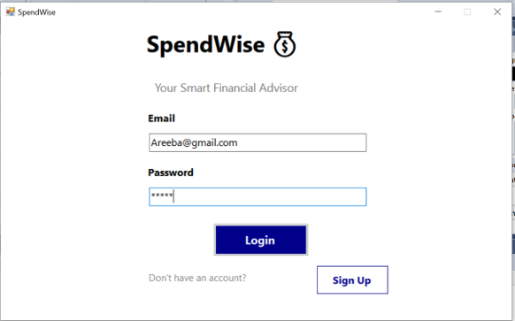

### Create Account

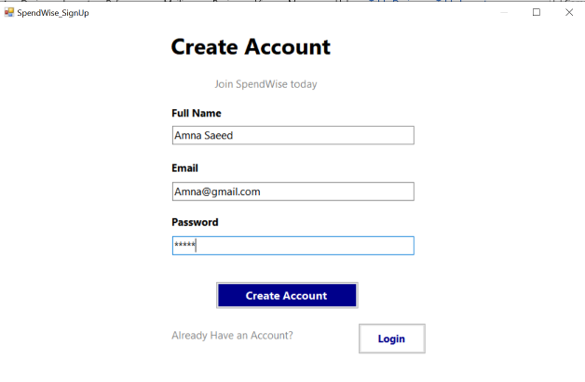

### Dashboard

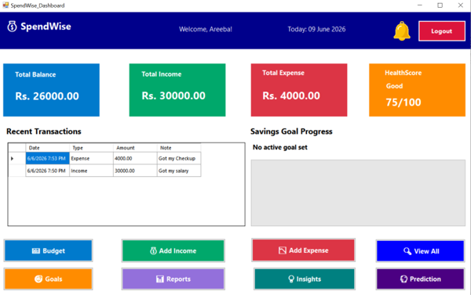

### Add Expense

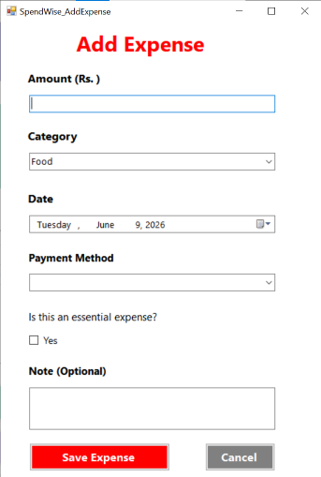

### Add Income

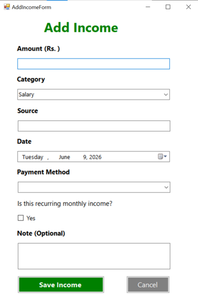

### All Transactions

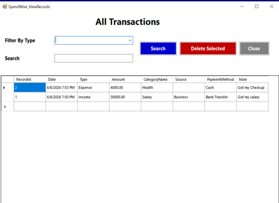

### Budget Manager

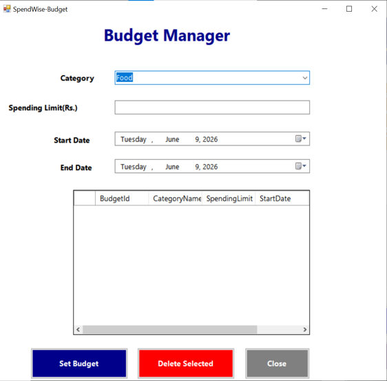

### Saving Goals

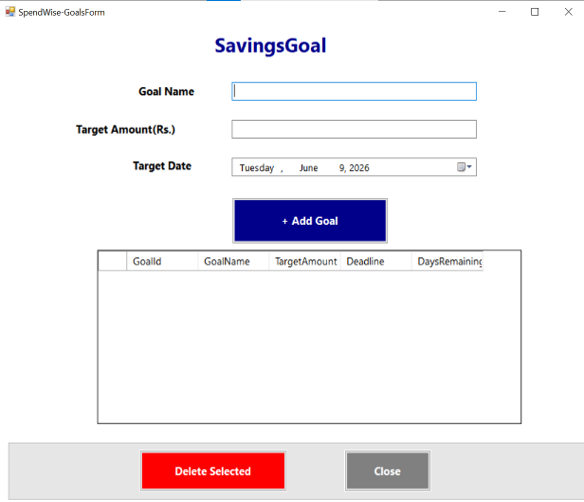

### Notifications

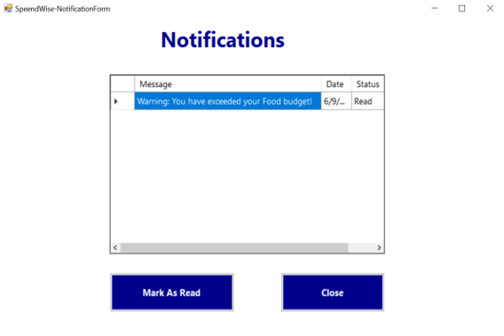

### Smart Insight Popup

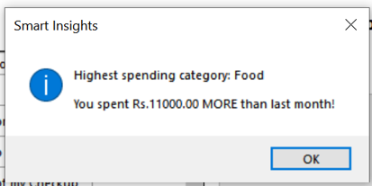

### Prediction Popup

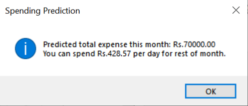

### Report

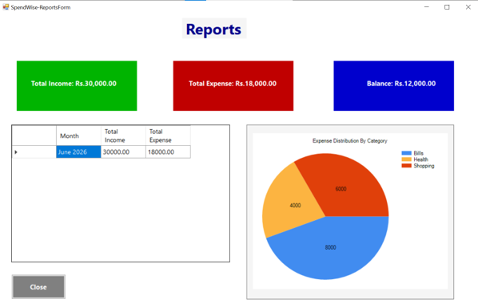

## Getting Started

1. Clone the repository
2. Open SpendWise.sln in Visual Studio
3. Update the connection string in App.config to point to your local SQL Server instance
4. Run project_DB.sql in SQL Server Management Studio to set up the database schema
5. Build and run the project

## Notes

This project was built as part of a Database Systems + OOP academic requirement, deliberately using ADO.NET instead of Entity Framework as per course guidelines
